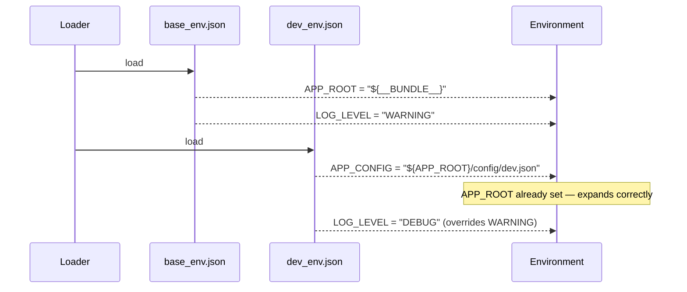
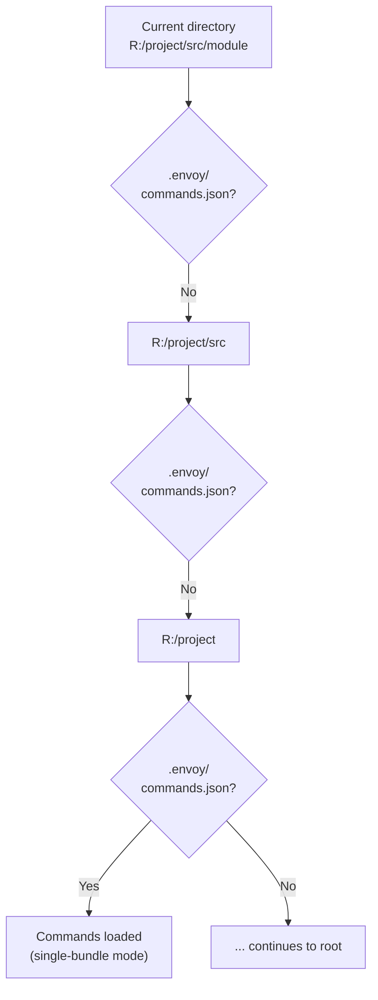
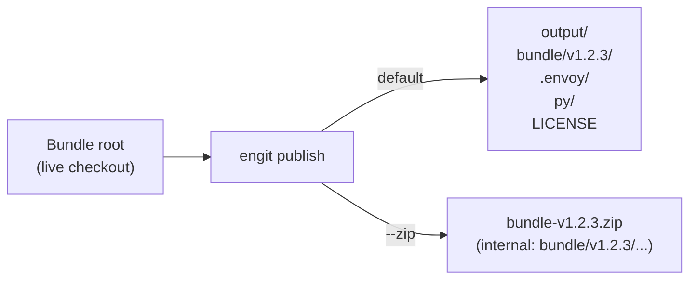

# Advanced Topics

## Environment File Chaining

Environment files are loaded in order; later files can reference variables set by earlier ones. This enables layered configuration where a base file sets roots and a dev file builds on them:



**`base_env.json`:**
```json
{
    "APP_ROOT": "${__BUNDLE__}"
}
```

**`dev_env.json`:**
```json
{
    "APP_CONFIG": "${APP_ROOT}/config/dev.json",
    "LOG_LEVEL": "DEBUG"
}
```

## Command Conflicts

When multiple bundles define the same command name, the **last discovered bundle wins**. Bundle discovery order is:

1. Order of entries in `--stack` / `-s` (top-to-bottom)
2. Order of roots in `ENVOY_BNDL_ROOTS` (left-to-right), then alphabetical within each root

```
WARNING - Command 'python' from gt:bundle-b overrides existing command from gt:bundle-a
```

Run `en --verbose --list` to see these warnings and identify the conflict source.

## Local Fallback

If no bundles are found through auto-discovery or a config file, Envoy walks up from the current working directory looking for `.envoy/commands.json`:



This allows running envoy from inside a project without any environment setup.

## `--trace` — Variable Mutation Debugging

Use `--trace VAR` to see exactly how a variable is built through each env file:

```powershell
en --trace PYTHONPATH python
```

Shows each assignment/append/prepend as it happens across `global_env.json` and the command's env files — useful when a path is missing or appearing in the wrong position.

## Path Normalization

All values produced by env file processing are normalized to OS-native path separators before being applied to the subprocess environment. On Windows, forward slashes are converted to backslashes.

You can write paths with either separator in JSON files:

```json
{
    "+=PYTHONPATH": "R:/repo/my-bundle/py"
}
```

The subprocess will see `R:\repo\my-bundle\py` on Windows.

## Bundle Publishing

The `engit publish` command produces a clean, deployment-ready copy of any bundle:



The default exclusions strip git artifacts, build outputs, and caches automatically. See [`engit publish`](cli-reference/engit.md#engit-publish) for full details.

## GitHub Actions — Reusable Bundle Publish Workflow

Simple bundles can adopt a one-file release workflow by calling the shared `bundle-publish.yml` from the envoy repository:

**`.github/workflows/build-release.yml`** in any bundle repo:
```yaml
name: Release

on:
  push:
    tags:
      - 'v*'

jobs:
  publish:
    uses: gtvfx-contrib/gt-envoy/.github/workflows/bundle-publish.yml@main
    with:
      extra_excludes: 'scripts pyproject.toml'  # optional
    secrets: inherit
    permissions:
      contents: write
```

When a `v*` tag is pushed, GitHub runs `engit publish --zip --output dist` and uploads the resulting zip to the release assets automatically.
