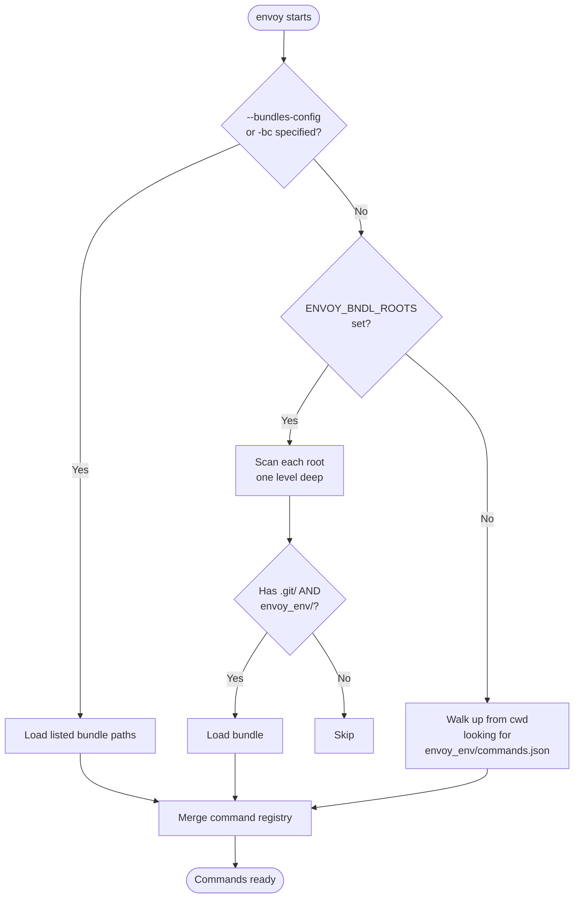
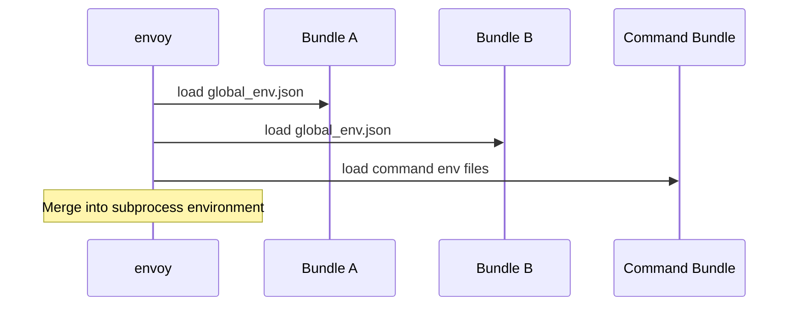
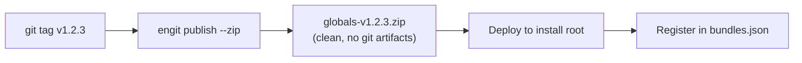

# Bundle Discovery

Envoy discovers commands from one or more **bundles** — Git repositories containing an `envoy_env/` directory. Commands from all discovered bundles are merged into a single registry.

## Discovery Flow



## Method 1 — Auto-Discovery via `ENVOY_BNDL_ROOTS`

Set `ENVOY_BNDL_ROOTS` to a semicolon-separated list of root directories. Envoy scans each root **one level deep** for subdirectories that are Git repositories with an `envoy_env/` directory.

=== "PowerShell"

    ```powershell
    $env:ENVOY_BNDL_ROOTS = "R:/repo/gtvfx-contrib;R:/repo/gtvfx"
    ```

=== "cmd"

    ```batch
    set ENVOY_BNDL_ROOTS=R:/repo/gtvfx-contrib;R:/repo/gtvfx
    ```

=== "Unix/macOS"

    ```bash
    export ENVOY_BNDL_ROOTS=/home/user/repos:/opt/studio
    ```

### Example structure

```
R:\repo\
├── gtvfx-contrib\
│   └── gt\
│       ├── globals\       ← .git/ + envoy_env/ ✓ discovered
│       ├── pythoncore\    ← .git/ + envoy_env/ ✓ discovered
│       └── utils\         ← no envoy_env/       ✗ skipped
└── gtvfx\
    └── unreal\            ← .git/ + envoy_env/ ✓ discovered
```

!!! note
    The scan is exactly one level deep per root. `R:/repo/gtvfx-contrib` discovers `gt/globals` but not `gtvfx-contrib/gt/globals` if the root points to `R:/repo` — point roots at the immediate parent of each bundle.

## Method 2 — Config File

Create a `bundles.json` and pass it with `--bundles-config` / `-bc`:

```json
{
    "bundles": [
        "R:/repo/gtvfx-contrib/gt/globals",
        "R:/repo/gtvfx-contrib/gt/pythoncore",
        "C:/tools/envoy/v1.0.0"
    ]
}
```

Or as a bare array:

```json
[
    "R:/repo/gtvfx-contrib/gt/globals",
    "R:/repo/gtvfx-contrib/gt/pythoncore"
]
```

```powershell
en --bundles-config R:/studio/bundles.json --list
en -bc R:/studio/bundles.json python_dev script.py
```

!!! tip
    When using deployed (non-checkout) bundles they have no `.git/` directory, so auto-discovery won't find them. Use `--bundles-config` to register them explicitly.

## Method 3 — Local Fallback

If no bundles are found via the above methods, Envoy walks up from the current directory looking for `envoy_env/commands.json`. This allows running from inside a single-bundle project without any setup.

## `global_env.json`

Any bundle may contain `envoy_env/global_env.json`. It is loaded automatically before every command's env files, regardless of which bundle the command comes from.

In multi-bundle mode, `global_env.json` is collected from **every** discovered bundle in discovery order:



## Command Conflicts

When two bundles define the same command name, the **last loaded bundle wins**:

```
WARNING - Command 'python_dev' from gt:bundle-b overrides existing command from gt:bundle-a
```

Use `--verbose` to surface these warnings and adjust bundle order in your config or `ENVOY_BNDL_ROOTS` to control priority.

## Environment Variables

| Variable | Separator | Description |
|---|---|---|
| `ENVOY_BNDL_ROOTS` | `;` (Windows) / `:` (Unix) | Root directories to scan for bundles |

## Versioning Roadmap

The current implementation treats all bundles as **checkout** bundles — live git working trees on disk. A production bundle workflow is planned:



`Bundle.version` returns `'checkout'` for all current path-based bundles. It will return a semver string for deployed production bundles once that workflow is fully implemented.
