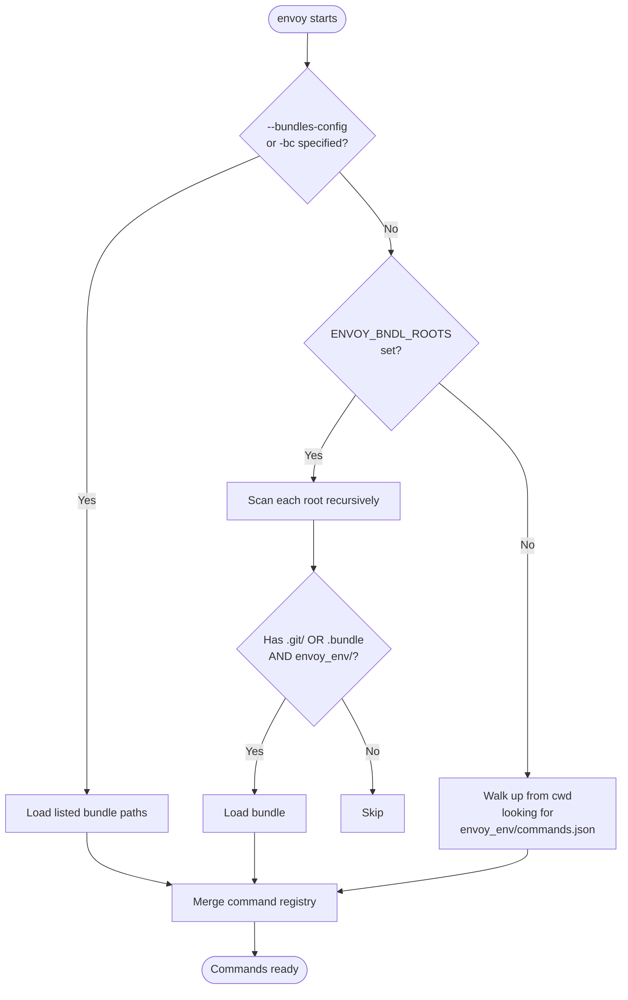
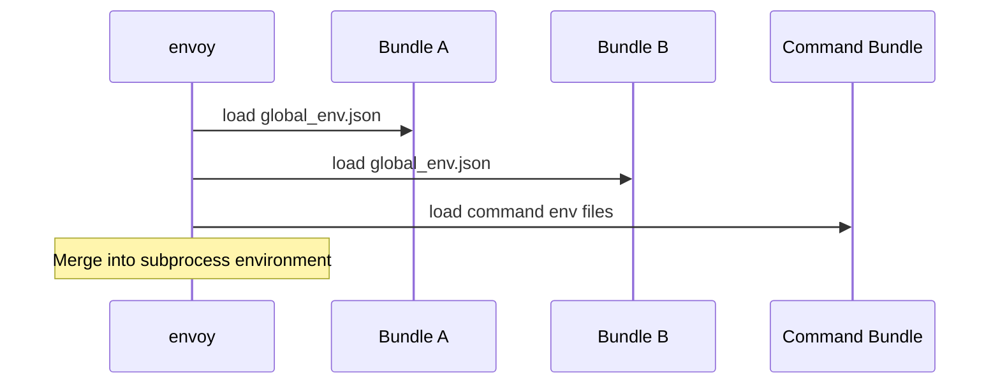
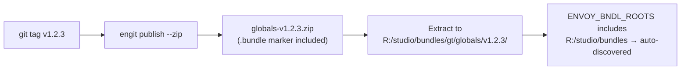

# Bundle Discovery

Envoy discovers commands from one or more **bundles** — directories containing an `envoy_env/` directory. Commands from all discovered bundles are merged into a single registry.

Bundles come in two forms:

| Form | Marker | `version` | `is_production` |
|------|--------|-----------|-----------------|
| **Checkout** | `.git/` directory | `'checkout'` | `False` |
| **Published** | `.bundle` file | e.g. `'v1.2.0'` | `True` |

## Discovery Flow



## Method 1 — Auto-Discovery via `ENVOY_BNDL_ROOTS`

Set `ENVOY_BNDL_ROOTS` to a semicolon-separated list of root directories. Envoy scans each root recursively for subdirectories that have an `envoy_env/` directory and either a `.git/` directory (checkout) or a `.bundle` marker file (published bundle).

=== "PowerShell"

    ```powershell
    $env:ENVOY_BNDL_ROOTS = "R:/repo/gtvfx-contrib;R:/studio/bundles"
    ```

=== "cmd"

    ```batch
    set ENVOY_BNDL_ROOTS=R:/repo/gtvfx-contrib;R:/studio/bundles
    ```

=== "Unix/macOS"

    ```bash
    export ENVOY_BNDL_ROOTS=/home/user/repos:/opt/studio/bundles
    ```

### Example structure — mixed checkout and published bundles

```
R:\studio\bundles\
├── gt\
│   ├── globals\         ← .bundle + envoy_env/ ✓ discovered (production v1.0.0)
│   └── pythoncore\      ← .bundle + envoy_env/ ✓ discovered (production v2.1.0)
R:\repo\
└── gtvfx-contrib\
    └── gt\
        └── my-tool\     ← .git/ + envoy_env/ ✓ discovered (checkout)
```

!!! note
    The scan walks up to 5 directory levels deep per root. Point roots at the parent of the namespace directory (e.g. `R:/repo/gtvfx-contrib`, not `R:/repo/gtvfx-contrib/gt`).

## The `.bundle` Marker File

Every bundle published via `engit publish` or `bundle-publish.yml` contains a `.bundle` file at its root. This file serves two purposes:

1. **Discovery marker** — `ENVOY_BNDL_ROOTS` scanning accepts it alongside `.git/` so deployed bundles are auto-discovered without a config file.
2. **Version metadata** — `Bundle.version` and `Bundle.is_production` read from it.

### Format

```json
{
  "name": "globals",
  "version": "v1.0.0",
  "published": "2026-06-21T10:13:00+00:00"
}
```

After extracting a published zip under a bundle root, envoy discovers it automatically — no `bundles.json` required.

## Method 2 — Config File

Create a `bundles.json` and pass it with `--bundles-config` / `-bc`:

```json
{
    "bundles": [
        "R:/repo/gtvfx-contrib/gt/globals",
        "R:/repo/gtvfx-contrib/gt/pythoncore",
        "C:/tools/envoy/v1.0.0"
    ]
}
```

Or as a bare array:

```json
[
    "R:/repo/gtvfx-contrib/gt/globals",
    "R:/repo/gtvfx-contrib/gt/pythoncore"
]
```

```powershell
en --bundles-config R:/studio/bundles.json --list
en -bc R:/studio/bundles.json python_dev script.py
```

### Environment variables in config paths

Path strings inside a bundle config file support `${VARNAME}` expansion.
Each token is resolved against the current process environment at load time,
making configs portable across machines or deployment roots:

```json
{
    "bundles": [
        "${STUDIO_PIPELINE_ROOT}/envoy/0.2.1",
        "${STUDIO_PIPELINE_ROOT}/globals/1.0.0",
        "${STUDIO_PIPELINE_ROOT}/pythoncore/2.1.0",
        "R:/fallback/myapp"
    ]
}
```

When envoy loads this config it replaces each `${VAR}` with the matching
environment variable value before resolving the path.

**Undefined variables** — if a referenced variable is not set in the
environment, envoy logs a warning (including the variable name and the config
file it came from) and **skips** that bundle entry.  The remaining entries
are still loaded normally.

!!! tip
    This is the same `${VARNAME}` syntax used in `envoy_env/*.json` files.

## Method 3 — Local Fallback

If no bundles are found via the above methods, Envoy walks up from the current directory looking for `envoy_env/commands.json`. This allows running from inside a single-bundle project without any setup.

## `global_env.json`

Any bundle may contain `envoy_env/global_env.json`. It is loaded automatically before every command's env files, regardless of which bundle the command comes from.

In multi-bundle mode, `global_env.json` is collected from **every** discovered bundle in discovery order:



## Command Conflicts

When two bundles define the same command name, the **last loaded bundle wins**:

```
WARNING - Command 'python_dev' from gt:bundle-b overrides existing command from gt:bundle-a
```

Use `--verbose` to surface these warnings and adjust bundle order in your config or `ENVOY_BNDL_ROOTS` to control priority.

## Environment Variables

| Variable | Separator | Description |
|---|---|---|
| `ENVOY_BNDL_ROOTS` | `;` (Windows) / `:` (Unix) | Root directories to scan for bundles |

## Published Bundle Workflow



`Bundle.version` returns `'checkout'` for git checkout bundles and the semver string (e.g. `'v1.2.0'`) for published bundles that carry a `.bundle` marker.
