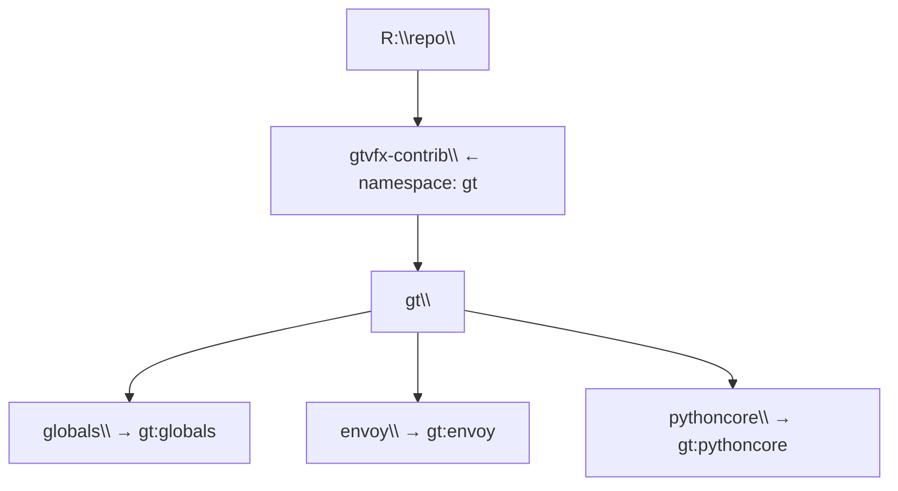

# Core Concepts

## Bundles

A **bundle** is a Git repository containing an `.envoy/` directory. Each bundle can define commands and environment files.

```
my-bundle/
├── .git/
├── .envoy/
│   ├── commands.json       ← command definitions
│   ├── global_env.json     ← loaded before every command's env files
│   └── tool_env.json       ← per-tool environment
└── src/
```

Bundles are the unit of distribution in the envoy ecosystem. A developer checks out one or more bundles under a shared root, and envoy discovers all of them automatically via `ENVOY_BNDL_ROOTS`.

### Bundle ID (bndlid)

Each bundle has a **bundle ID** (`bndlid`) of the form `<namespace>:<name>`. The namespace is inferred from the parent directory name:



The default namespace is `gt`. It can be overridden via the Python API.

## Commands

Commands are defined in `.envoy/commands.json`:

```json
{
    "python": {
        "environment": ["python_env.json"],
        "alias": ["python", "-X", "dev"]
    },
    "unreal": {
        "environment": ["unreal_env.json"]
    },
    "build": {
        "environment": ["build_env.json"],
        "alias": ["make", "build"]
    }
}
```

| Field | Required | Description |
|---|---|---|
| `environment` | Yes | List of env JSON files to load (relative to `.envoy/`) |
| `alias` | No | Executable + base args. `alias[0]` is the exe; `alias[1:]` are prepended args. If omitted, the command name is used as the executable. |

### Running Commands

```powershell
en python script.py --arg value
en unreal MyGame.uproject
en build --target Release
```

Anything after the command name is passed through verbatim to the child process.

## Environment Files

Environment files are JSON files that define variable assignments. They use **operator prefixes** on keys to control how values are applied:

| Key syntax | Effect |
|---|---|
| `"VAR": "value"` | Assign / replace |
| `"+=VAR": "value"` | Append to existing, separated by the OS path separator |
| `"^=VAR": "value"` | Prepend to existing, separated by the OS path separator |
| `"?=VAR": "value"` | Set only if `VAR` is not already defined (default / fallback) |

**List values** — A JSON array is joined with the OS path separator:

```json
{
    "PYTHONPATH": [
        "${__BUNDLE__}/py",
        "${__BUNDLE__}/vendor"
    ]
}
```

**Variable expansion** — Use `${VARNAME}` to reference variables already in scope:

```json
{
    "APP_ROOT": "${__BUNDLE__}",
    "APP_CONFIG": "${APP_ROOT}/config/dev.json",
    "+=PYTHONPATH": "${__BUNDLE__}/src"
}
```

See [Environment Files](env-files.md) for the full reference.

## Team Configuration

A bundle may define `.envoy/team.json` with team-scoped settings — a production packages/pipelines root, and an optional per-user/host config file path:

```json
{
    "name": "bfd",
    "prodPackagesRoot": "\\\\server\\packages",
    "prodPipelinesRoot": "\\\\server\\pipelines"
}
```

Envoy discovers and resolves the first `team.json` found across discovered bundles automatically — see it with `envoy --diagnose`, or from Python via `envoy.getCurrentTeamConfig()`.

## Pipelines

A bundle may define `.envoy/pipeline.json` to participate in context-aware pipeline resolution — a colon-separated context (e.g. via the `ENVOY_PIPELINE_CONTEXT` environment variable) resolves to the most specific matching pipeline, falling back to broader contexts and finally a default namespace:

```json
{
    "name": "build",
    "namespace": "bfd"
}
```

See it with `envoy --diagnose`, or from Python via `envoy.getCurrentPipeline()`.

## Package Cache

Envoy maintains a local, content-addressed cache for **published/production** bundles (never for your own checkout — a bundle with a `.git` directory is never substituted for a cached copy). The cache location defaults to a platform-appropriate directory and can be overridden via the `package_cache_dir` user-config setting or the `ENVOY_PACKAGE_CACHE` environment variable. See `envoy --diagnose` for its current status.

## VCS Integration

`envoy.Vcs.detect()` (Python) or `envoy --diagnose` (CLI) auto-detects the current working copy's version control backend — Git, Perforce, or [Lore](https://github.com/EpicGames/lore) — and reports pending changes through a single, normalized interface, regardless of which backend is in use. Set `ENVOY_VCS` to force a specific backend.
