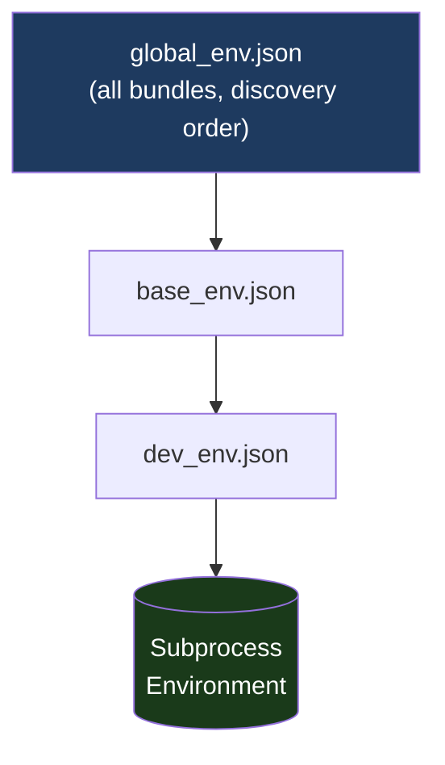

# Environment Files

Environment files are JSON files placed in a bundle's `envoy_env/` directory. They are listed in `commands.json` under the `environment` key and loaded in order when a command runs.

## Operators

Every key may carry an optional operator prefix:

| Key syntax | Effect |
|---|---|
| `"VAR": "value"` | Assign — set `VAR` to `value`, replacing any existing value |
| `"+=VAR": "value"` | Append — join `value` to the existing `VAR` with the OS path separator |
| `"^=VAR": "value"` | Prepend — join `value` before the existing `VAR` with the OS path separator |
| `"?=VAR": "value"` | Default — set `VAR` only if it is not already defined |

The OS path separator is `;` on Windows and `:` on Unix/macOS.

## Values

### Strings

```json
{
    "APP_NAME": "MyApp",
    "DEBUG": "1",
    "LOG_LEVEL": "DEBUG"
}
```

### Lists (path arrays)

A JSON array is joined into a single string using the OS path separator. This is the recommended form for `PATH`, `PYTHONPATH`, and similar multi-path variables:

```json
{
    "PYTHONPATH": [
        "${__BUNDLE__}/py",
        "${__BUNDLE__}/vendor",
        "R:/shared/libs"
    ]
}
```

### Null / Undefined Values

Setting a key to `null` skips that entry entirely and emits a warning. No value is written to the environment:

```json
{
    "SITE_PACKAGES": null
}
```

```
WARNING: Variable 'SITE_PACKAGES' is null in python_env.json — skipping.
```

When a list item resolves to `null` or contains an unresolved `${VAR}` reference (where `VAR` is not defined), only that item is dropped. The other items in the list are still applied:

```json
{
    "PYTHONPATH": [
        "${__BUNDLE__}/py",
        "${ENVOY_SITE_PACKAGES}",
        "R:/shared/libs"
    ]
}
```

If `ENVOY_SITE_PACKAGES` is not defined, only that entry is skipped:

```
WARNING: List item '${ENVOY_SITE_PACKAGES}' in 'PYTHONPATH' (python_env.json)
         contains unresolved references: ENVOY_SITE_PACKAGES — skipping item.
```

## Variable Expansion

Use `${VARNAME}` to reference a variable already in scope. References resolve against the environment being built, not the raw system environment:

```json
{
    "APP_ROOT": "${__BUNDLE__}",
    "APP_BIN":  "${APP_ROOT}/bin",
    "+=PATH":   "${APP_BIN}"
}
```

## Special Variables

These are automatically available in every env file:

| Variable | Value |
|---|---|
| `${__BUNDLE__}` | Bundle root directory (parent of `envoy_env/`) |
| `${__BUNDLE_ENV__}` | The `envoy_env/` directory |
| `${__BUNDLE_NAME__}` | Bundle directory name |
| `${__FILE__}` | Full path of the current JSON file being loaded |

## Path Normalization

All paths in env file values are normalized to OS-native separators at the time they are applied to the environment. On Windows, forward slashes are converted to backslashes automatically.

You may write paths with either forward or back slashes in your JSON files — the output will always be consistent for the target OS.

## `global_env.json`

If a bundle contains `envoy_env/global_env.json`, it is loaded automatically before any command-specific env files for every command sourced from that bundle. Use it for bundle-wide or studio-wide baseline variables:

```json
{
    "PYTHONDONTWRITEBYTECODE": "1",
    "STUDIO": "gtvfx"
}
```

In multi-bundle mode, `global_env.json` is collected from **every** discovered bundle in discovery order. Bundle order controls how `+=`/`^=` operators compose across these baseline layers.

## Loading Order

For a command `python_dev` with `"environment": ["base_env.json", "dev_env.json"]`:



Later files override earlier ones for plain assignment (`=`). Append/prepend operators accumulate.

## Examples

### Python environment

```json
{
    "+=PYTHONPATH": [
        "${__BUNDLE__}/py",
        "${__BUNDLE__}/vendor"
    ],
    "PYTHONDONTWRITEBYTECODE": "1",
    "PYTHONUTF8": "1"
}
```

### Application with optional site packages

```json
{
    "PYTHONPATH": [
        "${__BUNDLE__}/py",
        "${ENVOY_SITE_PACKAGES}",
        "R:/shared/libs/py"
    ]
}
```

If `ENVOY_SITE_PACKAGES` is not set, the entry is silently skipped.

### Default / fallback variable

```json
{
    "?=LOG_DIR": "${__BUNDLE__}/logs"
}
```

Sets `LOG_DIR` only if it has not already been set by an earlier env file.

### Full chaining example

**`base_env.json`:**
```json
{
    "APP_ROOT": "${__BUNDLE__}",
    "LOG_LEVEL": "WARNING"
}
```

**`dev_env.json`:**
```json
{
    "APP_CONFIG": "${APP_ROOT}/config/dev.json",
    "LOG_LEVEL": "DEBUG"
}
```

`APP_ROOT` is set by `base_env.json` and referenced by `dev_env.json`. `LOG_LEVEL` is overridden to `DEBUG`.
