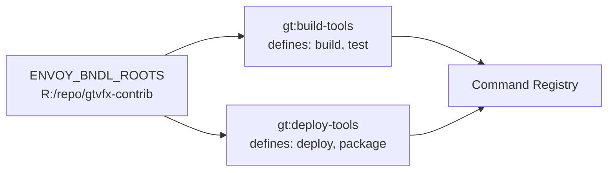
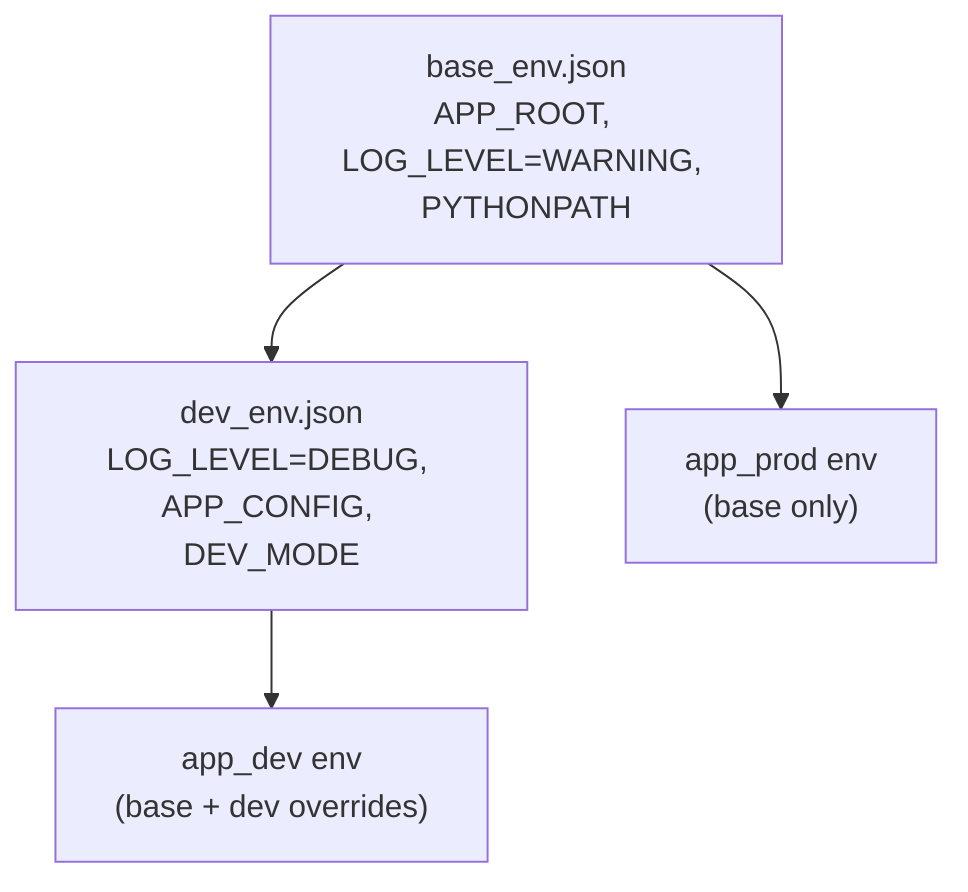

# Examples

## Example 1 — Python Development Environment

**`.envoy/commands.json`:**
```json
{
    "python_dev": {
        "environment": ["python_env.json"],
        "alias": ["python", "-X", "dev"]
    }
}
```

**`.envoy/python_env.json`:**
```json
{
    "+=PYTHONPATH": "${__BUNDLE__}/src",
    "PYTHONDONTWRITEBYTECODE": "1",
    "PYTHONUTF8": "1"
}
```

**Usage:**
```powershell
en python_dev script.py
en python_dev -m pytest tests/
```

---

## Example 2 — Unreal Engine

**`.envoy/commands.json`:**
```json
{
    "unreal": {
        "environment": ["unreal_env.json"]
    }
}
```

**`.envoy/unreal_env.json`:**
```json
{
    "+=PYTHONPATH": "${__BUNDLE__}/py",
    "+=PATH":       "${__BUNDLE__}/bin",
    "UE_BIN":       "D:/Epic Games/UE_5.7/Engine/Binaries/Win64/UnrealEditor.exe"
}
```

**Usage:**
```powershell
en unreal
en unreal MyGame.uproject
```

---

## Example 3 — Multi-Bundle Setup

With `ENVOY_BNDL_ROOTS=R:/repo/gtvfx-contrib` and two bundles discovered:



```powershell
en --list
```

```
Available commands:

  build                [gt:build-tools]
  test                 [gt:build-tools]
  deploy               [gt:deploy-tools]
  package              [gt:deploy-tools]
```

```powershell
en build --target Release
en deploy --env production
```

---

## Example 4 — Shared Baseline via `global_env.json`

**`gt:globals/.envoy/global_env.json`:**
```json
{
    "PYTHONDONTWRITEBYTECODE": "1",
    "STUDIO": "gtvfx"
}
```

This file is loaded before every command's env files from every bundle. Any bundle can reference `${STUDIO}` in its own env files:

```json
{
    "APP_CACHE": "R:/cache/${STUDIO}"
}
```

---

## Example 5 — Optional Site Packages

A common pattern where an additional Python path is only included when a specific env var is defined (e.g. set in `ENVOY_ALLOWLIST` on some machines):

**`python_env.json`:**
```json
{
    "PYTHONPATH": [
        "${__BUNDLE__}/py",
        "${ENVOY_SITE_PACKAGES}",
        "R:/shared/libs/py"
    ]
}
```

When `ENVOY_SITE_PACKAGES` is not defined, envoy warns and skips only that entry:

```
WARNING: List item '${ENVOY_SITE_PACKAGES}' in 'PYTHONPATH' (python_env.json)
         contains unresolved references: ENVOY_SITE_PACKAGES — skipping item.
```

The remaining paths are still applied normally.

---

## Example 6 — Layered Dev / Prod Environments

**`.envoy/commands.json`:**
```json
{
    "app_prod": {
        "environment": ["base_env.json"]
    },
    "app_dev": {
        "environment": ["base_env.json", "dev_env.json"]
    }
}
```

**`base_env.json`:**
```json
{
    "APP_ROOT": "${__BUNDLE__}",
    "LOG_LEVEL": "WARNING",
    "+=PYTHONPATH": "${__BUNDLE__}/py"
}
```

**`dev_env.json`:**
```json
{
    "LOG_LEVEL": "DEBUG",
    "APP_CONFIG": "${APP_ROOT}/config/dev.json",
    "DEVELOPMENT_MODE": "1"
}
```


