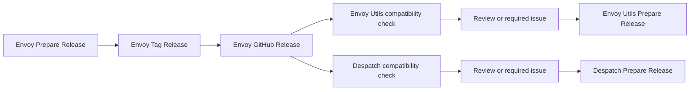

# Releasing Envoy, Envoy Utils, and Despatch

The three projects are independently versioned. Envoy releases are assessed
automatically against Envoy Utils and Despatch, but maintainers decide whether
a passing downstream project needs to be repinned and released.



## One-time organization setup

Create and install an organization GitHub App named
`gt-release-automation` on `envoy`, `envoy_utils`, and `despatch`.
Grant these repository permissions:

- Metadata: read
- Contents: read and write
- Pull requests: read and write
- Issues: read and write

Store the credentials as organization Actions secrets, restricted to those
three repositories:

- `RELEASE_AUTOMATION_APP_ID`
- `RELEASE_AUTOMATION_PRIVATE_KEY`

Allow GitHub Actions to create pull requests in the organization or in each
repository's **Actions > General > Workflow permissions** settings.

Set the `RELEASE_AUTOMATION_ENABLED` repository variable to `true` in Envoy
after the App is installed everywhere. Until then, Envoy releases still build
normally but do not dispatch downstream assessments.

The App token is used only in trusted manual and release workflows. Pull
request compatibility checks use read-only repository credentials.

## Release and compatibility states

Automated downstream checks use three states:

- `none`: no relevant downstream contract changed.
- `review`: relevant code changed and the current downstream source passes
  against it. A maintainer must decide whether users need a newly linked or
  embedded runtime.
- `required`: the current downstream source fails to compile, test, package,
  or pass its runtime checks with the Envoy candidate.

Envoy Utils is tested against candidate Envoy Core on Linux and Windows.
Despatch is tested on Windows against the released Envoy wheel, including its
source tests, Ruff checks, PyInstaller build, final executable, bundled docs,
and frozen launch worker.

These checks can prove that a release is required when compatibility fails.
They cannot prove that a release is unnecessary when tests pass: a release may
still be needed to deliver new statically linked or embedded behavior.

## Standard release sequence

All operator-provided version inputs are unprefixed SemVer values such as
`0.6.0`. Automation adds the `v` prefix when it addresses Git tags. Stable and
prerelease SemVer values are accepted.

### Local validation before tagging

The release workflows repeat these checks in CI, but running them locally makes
failures easier to diagnose before creating a tag.

For Envoy Utils, run the preparation command from the `envoy_utils` checkout.
It updates the workspace version, sets the Envoy Core tag and exact crate
version, regenerates `Cargo.lock`, and runs a workspace build check:

```powershell
python scripts/release_automation.py prepare `
    --version 0.2.0 `
    --envoy-version 0.6.0
```

Then run the validator explicitly:

```powershell
python scripts/release_automation.py check `
    --expect-version 0.2.0 `
    --expect-envoy-version 0.6.0
```

`Cargo.toml` is the source declaration. It should name the Envoy repository,
its `v<version>` tag, and the matching exact crate version. `Cargo.lock` is the
Cargo-generated resolution and records the exact commit behind that tag. Do
not replace the tag URL with a GitHub `/commit/<hash>` URL or hand-edit the
lockfile. A valid lockfile source looks like:

```text
git+https://github.com/gtvfx-envoy/envoy?tag=v0.6.0#<commit>
```

The Envoy Utils release version and Envoy Core dependency version are
independent. For example, Envoy Utils `0.2.0` can be paired with Envoy Core
`v0.6.0`.

For Despatch, run its repository-local preparation workflow with the new
Despatch version and Envoy version, then run the repository's lint, test, and
executable-build checks before tagging. The release workflow performs the same
checks on Windows and uploads the executable only after a successful build.
### 1. Prepare Envoy

Run **Prepare Release** in `envoy` with the new version. It opens or updates
a draft pull request on `automation/release-v<version>` that:

- updates `[workspace.package].version` in `rust/Cargo.toml`;
- refreshes and validates the workspace entries in `rust/Cargo.lock`;
- preserves the intentional Python package placeholder version `0.0.0`;
- runs the release-readiness tests.

The Envoy pull request also runs an advisory Envoy Utils compatibility check
when Envoy Core source or dependencies change. A failure is reported as a
warning and evidence artifact; it does not block an intentional Envoy API
change from merging.

Review and merge the preparation pull request through the normal process.

### 2. Tag and publish Envoy

Run **Tag Release** in `envoy` with the same version. It verifies that:

- `main` contains the expected Cargo and lockfile version;
- the checkout matches `origin/main`;
- the exact `main` commit passed `lint.yml`;
- the tag and GitHub Release do not already exist.

The workflow pushes an annotated `v<version>` tag through the GitHub App. The
existing **Build & Release** workflow builds and tests all platforms, creates
checksums, and publishes the GitHub Release.

After publication, Envoy immediately dispatches an `envoy-released` event to
Envoy Utils and Despatch. Each repository validates the event against the
actual GitHub Release before acting.

### 3. Review downstream impact

Relevant releases create or update one issue per Envoy tag in each downstream
repository. The issue contains changed files, API usage, test evidence, and a
maintainer checklist. Duplicate or manually replayed events update the same
issue.

For `none`, the Actions summary records the decision and no issue is created.
For `review`, choose whether the new linked or embedded behavior is useful to
consumers. For `required`, update the downstream source as necessary before
preparing its release.

Envoy Utils and Despatch do not depend on each other and may proceed in
parallel.

### 4. Prepare and publish Envoy Utils when needed

Run **Prepare Release** in `envoy_utils` with:

- its new version; and
- the already-published Envoy version.

The generated pull request updates the Envoy Utils workspace version, changes
the Envoy Core Git tag and exact crate version together, runs
`cargo update -p envoy-core`, and validates the resolved commit in
`Cargo.lock`. Never edit the Git commit in `Cargo.lock` manually.

After the pull request passes and is merged, run **Tag Release** with the Envoy
Utils version. Its release body is the canonical compatibility record and
contains the Envoy Utils-to-Envoy Core pairing and pinned Envoy commit. The
release also attaches `compatibility.json`, covered by `SHA256SUMS`.

Publishing the release automatically closes its matching Envoy-impact issue.

### 5. Prepare and publish Despatch when needed

Run **Prepare Release** in `despatch` with its new version and the Envoy version
to embed. The pull request synchronizes `pyproject.toml`,
`py/despatch/__init__.py`, and both Envoy defaults in the executable release
workflow.

After review and merge, run **Tag Release** with the Despatch version. Its
existing tag build downloads exactly one compatible Windows ABI3 Envoy wheel,
builds the final windowed executable, runs its runtime smoke tests, and uploads
it to the GitHub Release. Publication closes the matching impact issue.

## Envoy Utils compatibility records

Do not maintain a compatibility matrix in the Envoy Utils README or docs home
page. Each GitHub Release is authoritative because patch releases within one
series may use different Envoy Core versions.

The `compatibility.json` schema is:

```json
{
  "schema_version": 1,
  "envoy_utils": {
    "version": "0.2.0",
    "tag": "v0.2.0",
    "commit": "<commit>"
  },
  "envoy_core": {
    "version": "0.6.0",
    "tag": "v0.6.0",
    "commit": "<commit>"
  }
}
```

Run **Backfill Release Compatibility** once in Envoy Utils for `0.1.0`. It
derives the existing `v0.1.0` to Envoy `v0.5.1` pairing from that tag's Cargo
manifest and lockfile, preserves the existing assets, adds
`compatibility.json`, updates the release body, and regenerates `SHA256SUMS`
over the complete asset set. Run this backfill before merging removal of the
old README and docs tables.

## Manual replay and failures

Both downstream **Envoy Release Impact** workflows accept an unprefixed Envoy
version for replay after a runner or external service failure.

- A failed preparation workflow changes no release state; fix the cause and
  rerun it. The existing automation branch and draft pull request are updated.
- A failed tag build normally does not publish a release because publication depends on
  every platform build. A later bookkeeping or issue-closing step can still fail
  after publication, so check the GitHub Release and its assets before rerunning.
- Do not move or reuse a published tag. Fix forward with a new patch release.
- If an Envoy release is bad, do not repin downstream projects to it. Publish a
  corrected Envoy patch first.
- A maintainer may close a `review` issue without releasing, but should record
  why the current pin remains appropriate.

## Release-train checklist

- [ ] GitHub App secrets are available and downstream dispatch is enabled.
- [ ] The Envoy preparation pull request passed normal and advisory checks.
- [ ] Envoy **Tag Release** published all archives, wheels, and checksums.
- [ ] Envoy Utils and Despatch impact workflows completed or were replayed.
- [ ] Every `review` or `required` issue has an explicit maintainer decision.
- [ ] Needed downstream preparation pull requests passed and were merged.
- [ ] Needed downstream releases were tagged through **Tag Release**.
- [ ] Envoy Utils release notes and `compatibility.json` agree.
- [ ] Matching downstream impact issues were closed by release publication.
