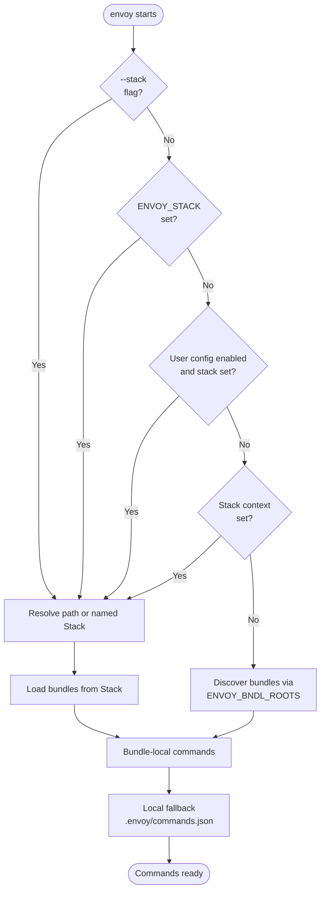

# User Configuration

Envoy stores per-user preferences in a persistent config file so you don't have
to repeat flags or paths on every invocation.

## Config file location

| OS | Path |
|----|------|
| Windows | `%USERPROFILE%\.envoy\user_config.json` |
| macOS / Linux | `~/.envoy/user_config.json` |

The directory is created automatically the first time a setting is saved.
Set `ENVOY_CONFIG_ROOT` to an absolute directory to replace the shared
`~/.envoy` root. Envoy then reads and writes
`$ENVOY_CONFIG_ROOT/user_config.json`. Empty values are ignored.

This path is intentionally consistent across supported platforms. Envoy does
not read or migrate files from the previous `%APPDATA%\envoy` or
`~/.config/envoy` locations.

## Managing settings

### Set a value

```powershell
envoy --set-config stack=R:/studio/envoy/studio.estack
```

### Clear a value

```powershell
envoy --set-config stack=
```

(Empty value after `=` removes the setting.)

### View current settings

```powershell
# All settings
envoy --get-config

# One specific setting
envoy --get-config stack
```

### List all configurable settings

```powershell
envoy --list-configs
```

This prints each setting name, its current value (or `not set`), a description,
and the allowed choices where applicable. When `ENVOY_STACK_ROOTS` is set, it
also lists all available named stacks.

### Bypass the config for one run

```powershell
envoy --ignore-config python script.py
```

`--ignore-config` (`-ic`) skips only the user config for that invocation.
`ENVOY_STACK`, context resolution, and `ENVOY_BNDL_ROOTS` discovery remain
available.

## Available settings

### `stack`

Path **or name** of the default Stack.

```powershell
# Point at a specific file
envoy --set-config stack=R:/studio/envoy/studio.estack

# Reference a named Stack (resolved via ENVOY_STACK_ROOTS)
envoy --set-config stack=studio
```

Once set, this is used automatically whenever neither `--stack` nor
`ENVOY_STACK` is supplied. See [Named stacks](#named-stacks) below.

### `verbosity`

Default verbosity level.  One of `quiet`, `normal`, or `verbose`.

```powershell
envoy --set-config verbosity=verbose
```

The `--verbose` (`-v`) flag always overrides this for the current run.

### `bundle_cache_dir`

Directory used for the local bundle cache. Set to an empty string to fall
back to the platform default location (`%LOCALAPPDATA%\envoy\bundle_cache`
on Windows, `~/.cache/envoy/bundle_cache` elsewhere).

```powershell
envoy --set-config bundle_cache_dir=R:/studio/envoy/bundle_cache
envoy --set-config bundle_cache_dir=   # clear it, fall back to the default
```

The `ENVOY_BUNDLE_CACHE` environment variable and the `--ignore-config` flag
both take precedence over this setting — see the
[CLI reference](cli-reference/envoy.md#environment-variables) for the full
precedence order.

## Resolution priority

When envoy determines which bundles to load it follows this priority order:



The context comes from an explicit API argument or `ENVOY_STACK_CONTEXT`.
Context lookup is not performed when no context is supplied.

## Named stacks

A named Stack (for example, `studio`) is a slot stored under
`ENVOY_STACK_ROOTS` with versioned history and a `latest.estack` symlink. This lets
teams publish and update a shared runtime environment without distributing a
specific file path.

### How envoy tells names from paths

A value is treated as a **name** when it contains no path separator characters
(`/`, `\`, `:`), does not start with a dot, and does not end in `.estack`.
Everything else is a path.

```powershell
envoy --set-config stack=studio          # name → resolved via ENVOY_STACK_ROOTS
envoy --set-config stack=R:/my/f.estack  # path → used directly
```

### `ENVOY_STACK_ROOTS`

Set this to one or more stack root directories (semicolon-separated on Windows,
colon-separated on Unix).  Envoy scans each root for named stack slots.

=== "PowerShell"

    ```powershell
    $env:ENVOY_STACK_ROOTS = "R:/studio/envoy/stack"
    ```

=== "cmd"

    ```batch
    set ENVOY_STACK_ROOTS=R:/studio/envoy/stack
    ```

=== "Unix/macOS"

    ```bash
    export ENVOY_STACK_ROOTS=/studio/envoy/stack
    ```

### Named Stack directory structure

```
R:\studio\envoy\stack\
└── studio\
    ├── 2026-06-21T10-13-00\
    │   └── studio.estack            ← versioned Stack
    ├── 2026-06-22T09-00-00\
    │   └── studio.estack            ← newer version
    └── latest.estack                → 2026-06-22T09-00-00\studio.estack
```

Each version is a timestamped directory containing an `.estack` file named for
the stack. `latest.estack` is a relative symlink to the most recently published
version.

### Publishing a named Stack

Use
[`engit publish stack`](https://github.com/gtvfx-envoy/envoy_utils/blob/main/docs/cli-reference/engit.md#engit-publish-stack)
from Envoy Utils to publish a new version and update `latest.estack`:

```powershell
engit publish stack V:/repo/gtvfx-envoy/stacks/studio/studio.estack
```

With an explicit stack root (instead of using `ENVOY_STACK_PUBLISH_ROOT`):

```powershell
engit publish stack V:/repo/gtvfx-envoy/stacks/studio/studio.estack --output R:/studio/envoy/stack
```

Dry-run to preview without writing:

```powershell
engit publish stack V:/repo/gtvfx-envoy/stacks/studio/studio.estack --dry-run
```

### Listing available named stacks

```powershell
envoy --list-configs
```

When `ENVOY_STACK_ROOTS` is set, `--list-configs` appends a table of all
available named stacks with their current version and resolved path.

## Config file format

The user config file is plain JSON:

```json
{
  "stack": "studio",
  "verbosity": "verbose"
}
```

You can edit it directly in any text editor — envoy reads it on every invocation.

## Python API

All user-config and named-Stack functionality is available in the `envoy`
Python package, making it easy to read or manipulate configuration
programmatically.

### `UserConfig`

```python
import envoy

# Load the current user config (never raises; returns empty config if absent)
cfg = envoy.loadUserConfig()
print(cfg.get('stack'))   # 'studio' or None

# Modify and save
cfg.set('stack', 'studio')
cfg.set('verbosity', 'verbose')
cfg.save()

# Inspect all stored settings
print(cfg.items())  # {'stack': 'studio', 'verbosity': 'verbose'}

# Remove a setting
cfg.unset('verbosity')
cfg.save()
```

Use `envoy.getConfigRoot()` to resolve the effective root at call time. The
config file path is also exposed as the import-time compatibility constant
`envoy.USER_CONFIG_PATH`, and the registry of valid settings as
`envoy.KNOWN_SETTINGS`.

```python
import envoy

print(envoy.getConfigRoot())   # <home>/.envoy
print(envoy.USER_CONFIG_PATH)  # <config root>/user_config.json
```

### `Stack`

`Stack` can be constructed from an explicit path, a named Stack, the current
selection sources, or a context.

```python
import envoy

# From an explicit path
stack = envoy.Stack('R:/studio/envoy/studio.estack')
for bundle in stack.bundles:
    print(bundle.bndlid, bundle.version)

# From a named Stack slot (resolved via ENVOY_STACK_ROOTS)
stack = envoy.Stack.from_name('studio')
print(stack.name)              # 'studio'
print(stack.namespace)         # 'gt'
print(stack.registry_version)  # '2026-06-21T10-13-00'
print(stack.path)              # /studio/envoy/stack/studio/2026-.../studio.estack
print(stack.commands)          # merged command list

# From the current CLI-equivalent selection sources
stack = envoy.Stack.current()
if stack is not None:
    print(stack.commands)
else:
    print('No Stack selected; use ENVOY_BNDL_ROOTS discovery')

# Convenience function
stack = envoy.getCurrentStack()

# Skip the user config for this call (mirrors --ignore-config)
stack = envoy.Stack.current(ignore_user_config=True)

# Resolve the most specific named Stack for a context
stack = envoy.Stack.resolve('studio:lighting:show_a')
```

See [Bundle discovery](bundle-discovery.md) for the strict `.estack` YAML
schema and the full resolution behavior.

### Named Stack registry

```python
import envoy

# Check whether a string is a Stack name or a path
envoy.isStackName('studio')                # True
envoy.isStackName('/path/to/f.estack')     # False

# Resolve a name to the latest published path
path = envoy.resolveNamedStack('studio')
print(path)  # Path('/studio/envoy/stack/studio/2026-06-22T09-00-00/studio.estack')

# List all available named Stacks
for entry in envoy.listNamedStacks():
    print(entry.name, entry.version, entry.path)

# All published versions for one name (newest first)
for version, path in envoy.listStackVersions('studio'):
    print(version, path)
```

The Stack root environment variable name is available as
`envoy.STACK_ROOTS_VAR` (`'ENVOY_STACK_ROOTS'`). Named entries are instances
of `envoy.NamedStackEntry`, with `.name`, `.version`, `.path`, and
`.stack_root` properties.
