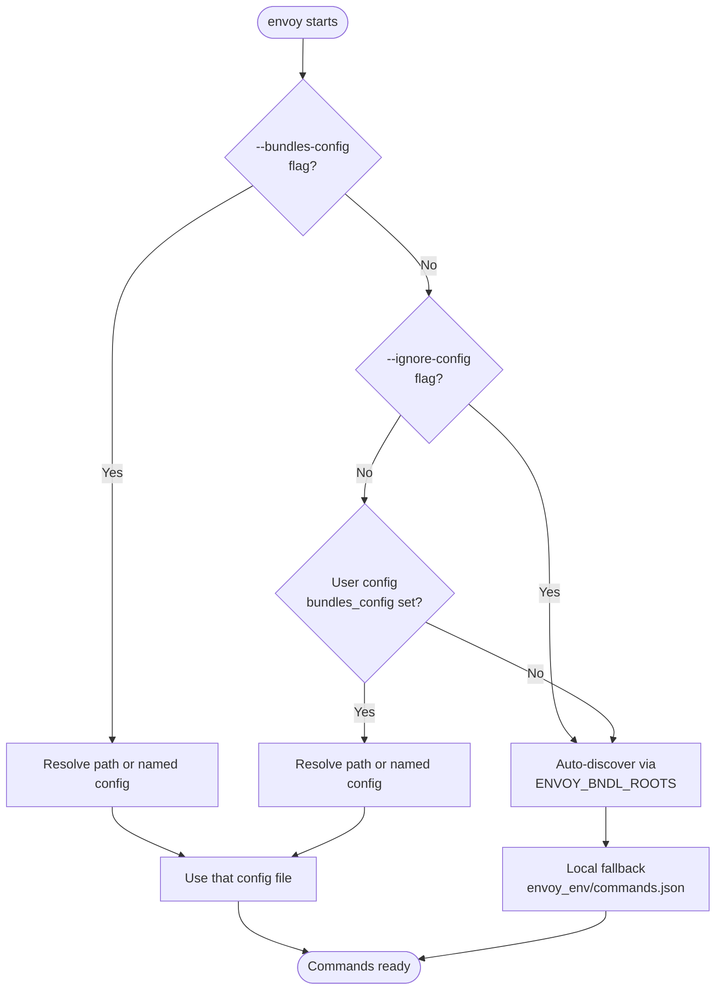

# User Configuration

Envoy stores per-user preferences in a persistent config file so you don't have
to repeat flags or paths on every invocation.

## Config file location

| OS | Path |
|----|------|
| Windows | `%APPDATA%\envoy\user_config.json` |
| macOS / Linux | `~/.config/envoy/user_config.json` |

The directory is created automatically the first time a setting is saved.
You can override the path for testing by setting the `ENVOY_USER_CONFIG`
environment variable.

## Managing settings

### Set a value

```powershell
envoy --set-config bundles_config=R:/studio/envoy/studio_bundles.json
```

### Clear a value

```powershell
envoy --set-config bundles_config=
```

(Empty value after `=` removes the setting.)

### View current settings

```powershell
# All settings
envoy --get-config

# One specific setting
envoy --get-config bundles_config
```

### List all configurable settings

```powershell
envoy --list-configs
```

This prints each setting name, its current value (or `not set`), a description,
and the allowed choices where applicable.  When `ENVOY_CFG_ROOTS` is set, it
also lists all available named configs.

### Bypass the config for one run

```powershell
envoy --ignore-config python_dev script.py
```

`--ignore-config` (`-ic`) skips the user config entirely for that invocation,
reverting to `ENVOY_BNDL_ROOTS` auto-discovery as if no config is set.

## Available settings

### `bundles_config`

Path **or name** of the default bundles config.

```powershell
# Point at a specific file
envoy --set-config bundles_config=R:/studio/envoy/bundles.json

# Reference a named config (resolved via ENVOY_CFG_ROOTS)
envoy --set-config bundles_config=studio
```

Once set, this is used automatically whenever `--bundles-config` is not
supplied on the command line.  See [Named configs](#named-configs) below.

### `verbosity`

Default verbosity level.  One of `quiet`, `normal`, or `verbose`.

```powershell
envoy --set-config verbosity=verbose
```

The `--verbose` (`-v`) flag always overrides this for the current run.

## Resolution priority

When envoy determines which bundles to load it follows this priority order:



## Named configs

A named config (e.g. `studio`) is a config slot stored under
`ENVOY_CFG_ROOTS` with versioned history and a `latest` pointer.  This lets
teams publish and update a shared bundles config that all users pull
automatically by name, without distributing a specific file path.

### How envoy tells names from paths

A value is treated as a **name** when it contains no path separator characters
(`/`, `\`, `:`) and does not start with a dot.  Everything else is a path.

```powershell
envoy --set-config bundles_config=studio          # name → resolved via ENVOY_CFG_ROOTS
envoy --set-config bundles_config=R:/my/f.json   # path → used directly
```

### `ENVOY_CFG_ROOTS`

Set this to one or more config root directories (semicolon-separated on Windows,
colon-separated on Unix).  Envoy scans each root for named config slots.

=== "PowerShell"

    ```powershell
    $env:ENVOY_CFG_ROOTS = "R:/studio/envoy/configs"
    ```

=== "cmd"

    ```batch
    set ENVOY_CFG_ROOTS=R:/studio/envoy/configs
    ```

=== "Unix/macOS"

    ```bash
    export ENVOY_CFG_ROOTS=/studio/envoy/configs
    ```

### Named config directory structure

```
R:\studio\envoy\configs\
└── studio\
    ├── 2026-06-21T10-13-00.json   ← versioned config
    ├── 2026-06-22T09-00-00.json   ← newer version
    └── latest                     ← text file: "2026-06-22T09-00-00.json"
```

Each version is a timestamped copy of a bundles-config JSON file.  The `latest`
file contains just the filename of the most recently published version.

### Publishing a named config

Use `engit publish-config` to publish a new version and update `latest`:

```powershell
engit publish-config studio R:/my/bundles.json
```

With an explicit config root (instead of using `ENVOY_CFG_ROOTS`):

```powershell
engit publish-config studio R:/my/bundles.json --cfg-root R:/studio/envoy/configs
```

Dry-run to preview without writing:

```powershell
engit publish-config studio R:/my/bundles.json --dry-run
```

### Listing available named configs

```powershell
envoy --list-configs
```

When `ENVOY_CFG_ROOTS` is set, `--list-configs` appends a table of all
available named configs with their current version and resolved path.

## Config file format

The user config file is plain JSON:

```json
{
  "bundles_config": "studio",
  "verbosity": "verbose"
}
```

You can edit it directly in any text editor — envoy reads it on every invocation.

## Python API

All user-config and named-config functionality is available in the `envoy`
Python package, making it easy to read or manipulate configuration
programmatically.

### `UserConfig`

```python
import envoy

# Load the current user config (never raises; returns empty config if absent)
cfg = envoy.loadUserConfig()
print(cfg.get('bundles_config'))   # 'studio' or None

# Modify and save
cfg.set('bundles_config', 'studio')
cfg.set('verbosity', 'verbose')
cfg.save()

# Inspect all stored settings
print(cfg.items())  # {'bundles_config': 'studio', 'verbosity': 'verbose'}

# Remove a setting
cfg.unset('verbosity')
cfg.save()
```

The config file path is exposed as `envoy.USER_CONFIG_PATH` and the registry
of valid settings as `envoy.KNOWN_SETTINGS`.

### `BundleConfig`

`BundleConfig` can now be constructed from a named config slot or from the
current user configuration, in addition to an explicit path.

```python
import envoy

# ── From an explicit path ──────────────────────────────────────────────────
cfg = envoy.BundleConfig('R:/studio/envoy/studio_bundles.json')
for bundle in cfg.bundles:
    print(bundle.bndlid, bundle.version)

# ── From a named config slot (resolved via ENVOY_CFG_ROOTS) ───────────────
cfg = envoy.BundleConfig.from_name('studio')
print(cfg.name)         # 'studio'
print(cfg.cfg_version)  # '2026-06-21T10-13-00'
print(cfg.path)         # /studio/envoy/configs/studio/2026-...json
print(cfg.commands)     # merged command list

# ── From whatever the user has configured ─────────────────────────────────
cfg = envoy.BundleConfig.current()
if cfg is not None:
    print(cfg.commands)
else:
    print("No bundle config set — use ENVOY_BNDL_ROOTS auto-discovery")

# Convenience alias
cfg = envoy.getCurrentBundleConfig()

# Skip the user config for this call (mirrors --ignore-config)
cfg = envoy.BundleConfig.current(ignore_user_config=True)
```

### Named config registry

```python
import envoy

# Check whether a string is a config name or a path
envoy.isConfigName('studio')          # True
envoy.isConfigName('/path/to/f.json') # False

# Resolve a name to the latest published path
path = envoy.resolveNamedConfig('studio')
print(path)  # Path('/studio/envoy/configs/studio/2026-06-22T09-00-00.json')

# List all available configs
for entry in envoy.listNamedConfigs():
    print(entry.name, entry.version, entry.path)

# All published versions for one name (newest first)
for version, path in envoy.listConfigVersions('studio'):
    print(version, path)

# Publish a new version programmatically
from pathlib import Path
envoy.publishConfig(
    cfg_root=Path('R:/studio/envoy/configs'),
    name='studio',
    source_path=Path('R:/my/bundles.json'),
)
```

The config root environment variable name is available as `envoy.CFG_ROOTS_VAR`
(`'ENVOY_CFG_ROOTS'`).  Named config entries are instances of
`envoy.NamedConfigEntry` — a dataclass with `.name`, `.version`, `.path`, and
`.cfg_root` attributes.
